# Group 7 Project 3: Last Updated: May 2025 

## Overview
A data science project analyzing Federal Statistical Research Data Center (FSRDC) outputs, featuring:  
- **Python** data processing
- **Interactive visualizations** 
- **GitHub Pages**

## Files

When simulating this project, please keep everything in order:

```bash
.  
├── data/                         # Final output dataset  
│   └── ResearchOutputs_Group7.xlsx  
├── scripts/                      # Analysis code and data files needed  
│   ├── main.py                   # Main pipeline  
│   ├── data_processing.py  
│   ├── EDA.py  
│   ├── Model_Analysis_PCA.py  
│   ├── Clustering.py  
│   ├── FinalCleanedMergedResearchOutputs.csv  
│   ├── FinalOutputWithAPIMetadata_Deduplicated.csv  
│   ├── group1.csv ... group8.csv  
│   ├── ProjectsAllMetadata.xlsx  
│   └── ResearchOutputs.xlsx  
├── visualizations/               # Figures generated by analysis codes  
│   ├── Publications.png  
│   ├── PCA1.png  
│   ├── ClusteringScatter.png  
│   ├── LDA_TopicTerms.png  
│   ├── NetworkDegree.png  
│   ├── SentimentScore.png  
│   └── WordTrends.png  
├── report/                       # Project report  
│   └── Report_Group7.pdf  
├── dashboard.html                # Dashboard homepage  
├── figures.html                  # Figures generated by Plotly (Clustering.py)  
├── style.css                     # Custom styling  
└── requirements.txt              # Prerequisites
```
## Project 3 Description

This project represents the final stage of our multi-phase pipeline analyzing FSRDC-related research outputs. It involved consolidating datasets from eight independent student groups, each of which explored top researchers, institutions, and topics using different methodologies.

Our primary objective was to develop a scalable, validated, and enriched dataset that could serve as a unified foundation for advanced analysis. To achieve this, we engineered a robust Python pipeline that:

- Normalized and deduplicated data from over 39,000 raw records
- Applied fuzzy matching and TF-IDF similarity to validate project affiliations
- Enriched incomplete entries using the CrossRef and OpenAlex APIs
- Merged final results with official metadata from ResearchOutputs.xlsx

We then conducted a series of analytical tasks using Python:

### Exploratory Data Analysis (EDA):
- Top RDCs by output volume
- Most prolific authors
- Publication trends and citation distribution
- Time-to-publication lag

### Machine Learning and NLP:
- Trained classification models to predict output status
- Performed PCA for dimensionality reduction
- Clustered documents using K-Means and Agglomerative methods
- Applied LDA topic modeling to identify core research themes
- Conducted sentiment analysis on research abstracts
- Built a document similarity network to reveal local content clusters

### Trend & Network Analysis:
- Tracked keyword frequency shifts over time
- Clustered authors based on aggregated research themes
- Visualized document interconnections via a degree distribution network

All findings are published on our interactive [GitHub Pages site](https://chenxuli2001.github.io/Group-7-Project-3/), showcasing reproducible code, visual insights, and detailed documentation.


## Visualizations

### PCA Scree Plot (Top 5 Components)  
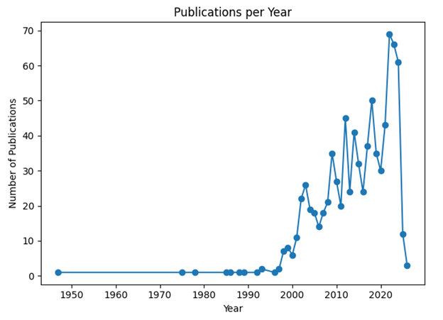  
*Figure 1. Variance explained by top 5 PCA components.*

---

### Clustering Scatter Plot (UMAP)  
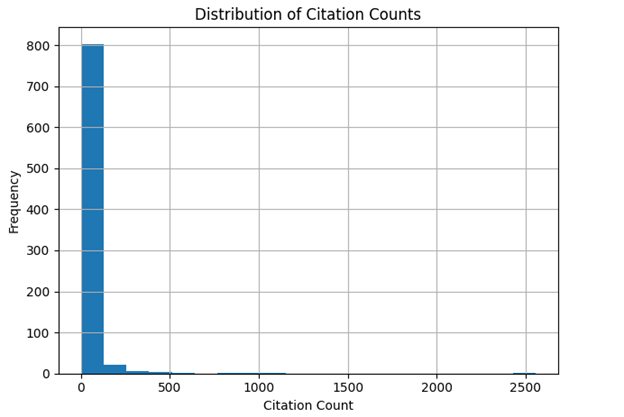  
*Figure 2. UMAP projection of clustered research outputs.*

---

### Publications Over Time  
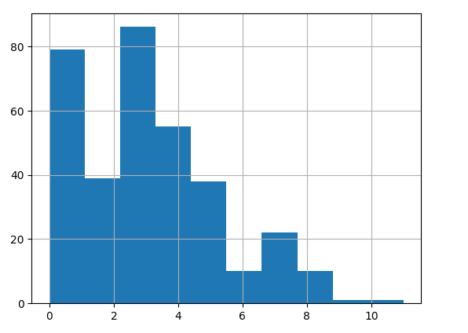  
*Figure 3. Number of FSRDC-related publications per year.*

---

### Citation Distribution  
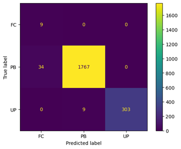  
*Figure 4. Distribution of citation counts across outputs.*

---

### Output Count Histogram  
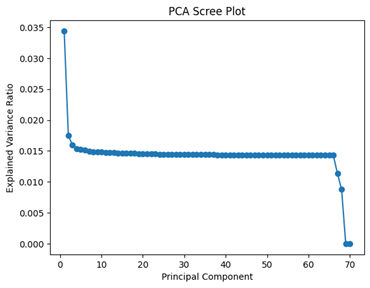  
*Figure 5. Distribution of number of outputs per project.*

---

### Confusion Matrix (Classification Model)  
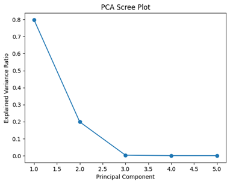  
*Figure 6. Confusion matrix for the model predicting output status.*

---

### PCA Scree Plot (Full)  
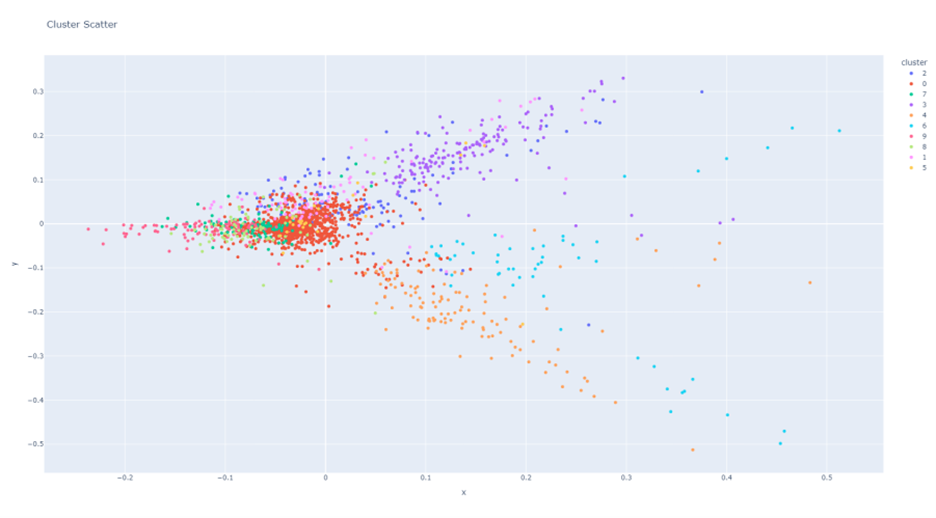  
*Figure 7. Variance explained by all PCA components.*

---

### Word Frequency by Year  
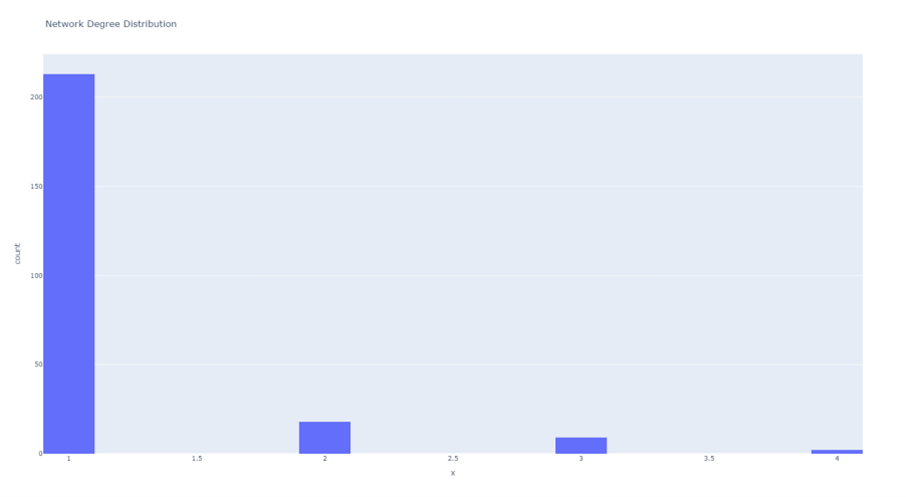  
*Figure 8. Top keyword trends over time.*

---

### Authors Per Cluster  
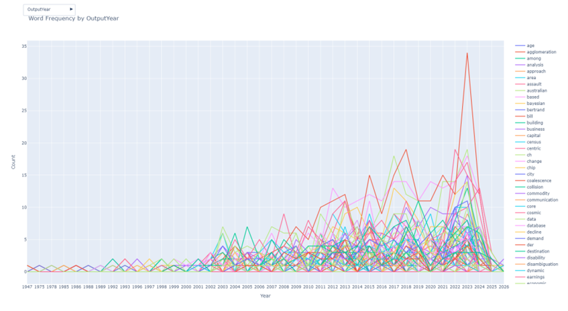  
*Figure 9. Author distribution across clusters.*

---

### Sentiment Score Distribution  
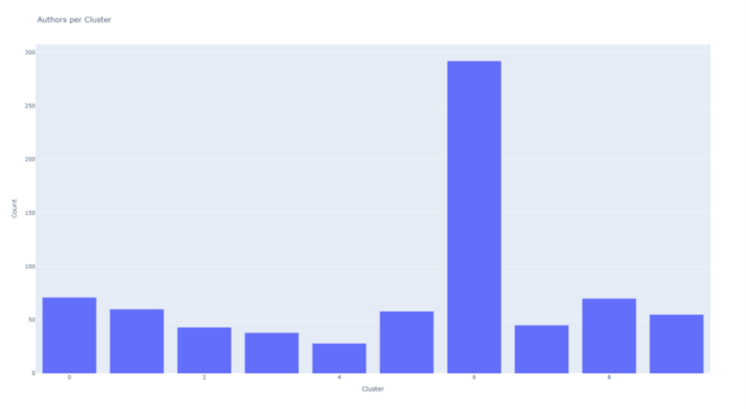  
*Figure 10. Sentiment polarity scores from research abstracts.*

---

### LDA Topic Terms  
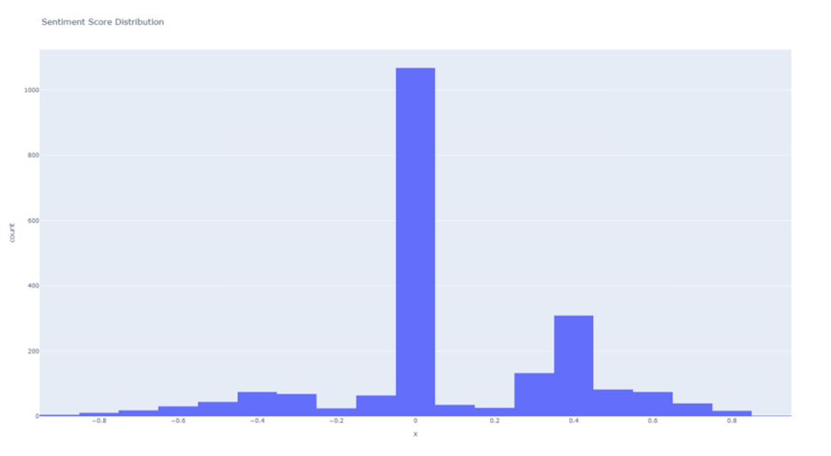  
*Figure 11. Top terms in each LDA-generated research topic.*

---

### Agglomerative Clustering  
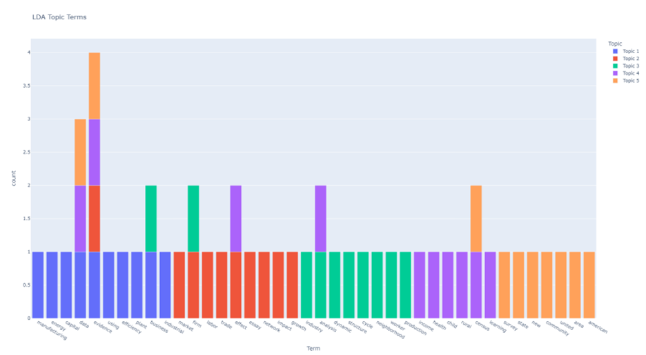  
*Figure 12. Ward linkage-based clustering of research documents.*

---

### Network Degree Distribution  
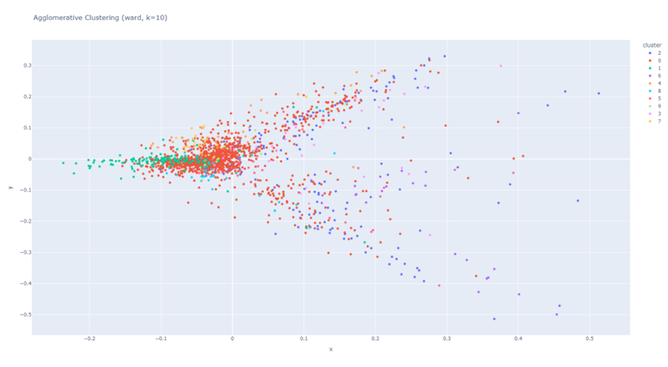  
*Figure 13. Degree distribution in the document similarity graph.*

## Simulations
When testing the results of this project, researchers should follow several steps:
1. Download all the files and arrange them like in the ## Files section.
2. According to requirements.txt, prepare the python environment and libraries.
3. Run the scripts according to the order showed in main.py file.
4. Open the dashboard.html to check the results.

## Acknowledgment

This project was completed as part of **CIT 5900-002 202510: Programming Languages and Techniques (Python)** in **Spring 2025** at the University of Pennsylvania.

**Instructor**: Dr. Kaihua Ding + TAs

**Group 7 Members**:
- Yuqiao Xue  
- Ziad Albitty  
- Jichang Wen  
- Chenxu Li  
- Nii Armah  

We are grateful to the course staff for their support and to our classmates for their collaborative spirit throughout the project phases.